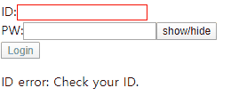

# vue-form

## Start Vue Project by creating Form

- App.vue

  - > 1. ctrl + a / cmd + a -> delete
    > 2. type vue -> default.vue
    > 3. Just like React.js, there should be 1 root html element per component

<br/>

- bind data to component, **v-model**

  - > <input _if_="username" _type_="text" _v-model_="username"/>

- vue.config.js

  - stop running eslint

<br/>

### Event controlling

- > v-on:submit.prevent === (event), event.preventDefault();

<br/>

### Login Validation

- Old: check user ID input

  > v-if:"true/false"

<br/>

- New: dynamically check user ID input

  - Use regex

    ```javascript
    function validateEmail(email) {
      var re = /^(([^<>()\[\]\\.,;:\s@"]+(\.[^<>()\[\]\\.,;:\s@"]+)*)|(".+"))@((\[[0-9]{1,3}\.[0-9]{1,3}\.[0-9]{1,3}\.[0-9]{1,3}\])|(([a-zA-Z\-0-9]+\.)+[a-zA-Z]{2,}))$/;
      return re.test(String(email).toLowerCase());
    }
    ```

  - computed:

    - runs whenever data, component is modified

<br/>

- dynamically display user input is correct or not

  - stylesheet only applied to current component

    > <style scoped>

  - CSS syntax

    ```css
    .classA.classB {
      border: 1px solid red;
    }
    ```

  - Vue dynamically change class

        ```javascript
        v-bind:class="{ 'error': !isUsernameValid }"
        ```

<br/>

- password show/hide

  

<br/>
<br/>

## UI Component: Toast Notification

- > 1. create ToastPopup.vue
  > 2. add the component to App.vue (same)
  >    - <toast-popup></toast-popup>
  >    - <ToastPopup></ToastPopup>
  > 3. create CSS on browser FIRST \*reset CSS

<br/>

- Send props to ToastPopup.vue, emit 'close' event to App.vue

  1. App.vue

     - > <ToastPopup _v-bind_:_open_="isSuccess"></ToastPopup>

  2. ToastPopup.vue

     - ```javascript
       export default {
         props: ["open"],
         data() {
           return {};
         },
         watch: {
           open(newValue) {
             if (newValue) {
               console.log("open ToastPopup");
               clearTimeout(timer);
               timer = setTimeout(() => this.$emit("close"), 2000);
             }
           }
         }
       };
       ```

<br/>
<br/>

## UI Component: Progress bar

- reset browser default margin

- @keyframes - during animation, change CSS style [link](https://www.w3schools.com/cssref/css3_pr_animation-keyframes.asp)

  - > animation: loading 1s linear

<br/>
<br/>

## Project setup

```
npm install
```

### Compiles and hot-reloads for development

```
npm run serve
```

### Compiles and minifies for production

```
npm run build
```

### Run your tests

```
npm run test
```

### Lints and fixes files

```
npm run lint
```

### Customize configuration

See [Configuration Reference](https://cli.vuejs.org/config/).
